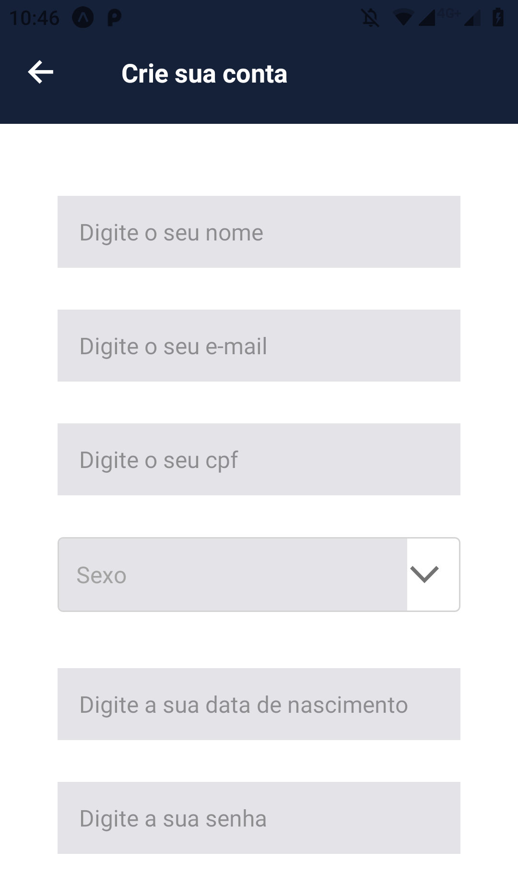
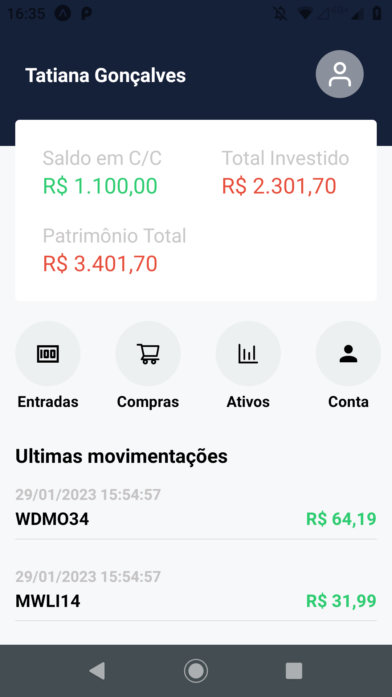
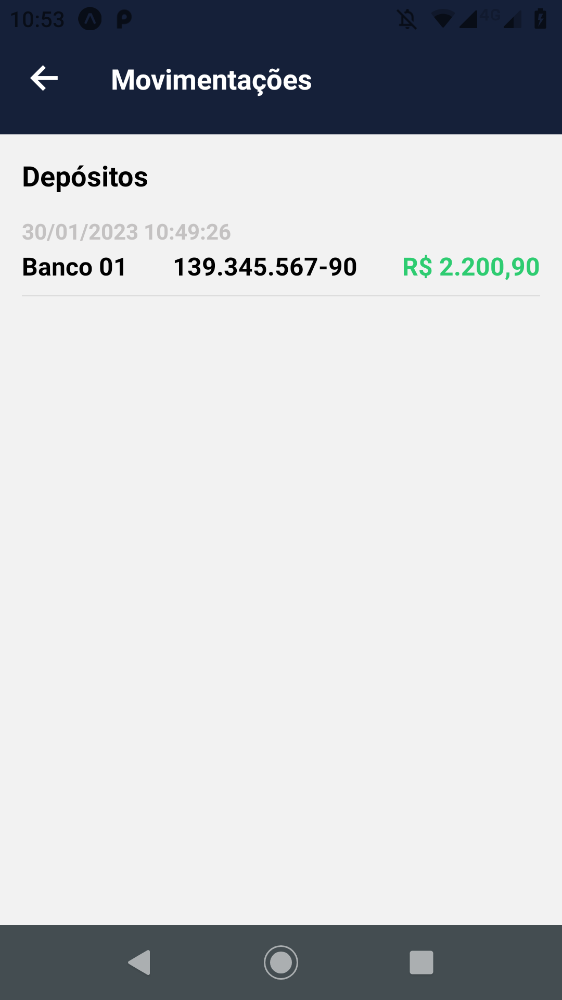

# **APP React Native Awesome Invest**
## **Escopo do produto**
O Projeto AWESOME INVEST é um sistema de gestão financeira criado para fins de estudo. O Sistema tem o objetivo de listar os ativos e efetuar o gerenciamento destes, possibilitando a consulta e compra por parte do cliente. Além de garantir que o Administrador realize depósitos em contas de clientes e a consulta das transações realizadas.
<br/>
<br/>

A API foi desenvolvida utilizando o NodeJs, ExpressJs e o ORM Sequelize com Banco de dados MySql. A Documentação foi feita utilizando o Swagger. O Jest e Supertest nos Testes Unitários e de Integração. E está disponível para consulta no link abaixo:
```
https://github.com/danielbarbozadasilva/financial-system-backend.git
```
<br/>
<br/>


## **Instalação**
Clone o repositório na pasta de sua preferência.
```
git clone https://github.com/danielbarbozadasilva/app-financial-React-Native
```

Abra a pasta do repositório clonado, e crie um arquivo ".env", exemplo:
```
API_URL=http://192.168.0.14:3011/v1
API_URL_IMAGE=192.168.0.14
API_TOKEN_KEY=exemplo
```

Abra a pasta do repositório clonado, e instale as dependências do projeto através do comando:
```
yarn install
```

Execute o comando para rodar o projeto:
```
expo start
```
<br/>

## **Requisitos funcionais**
<br/>

RF001 – O sistema deve controlar a autenticação dos usuários.

RF002 – O sistema deve manter cadastro de clientes.

RF003 – O sistema deve controlar a venda de ativos.

RF004 – O sistema deve listar as transações efetuadas.

RF005 – O sistema deve listar os depósitos efetuadas.

RF006 – O sistema deve listar os dados bancários do cliente.

<br/>
<br/>

## **Requisitos não funcionais**
<br/>

| Identificação | Classificação | Descrição |
| --- | --- | --- |
|RNF001   |Implementação     |O back-end do sistema deve ser desenvolvido em NodeJs e ExpressJs.    |
|RNF002   |Implementação     |O front-end do sistema deve ser desenvolvido em ReactJs.    |
|RNF003   |Implementação     |O aplicativo deve ser desenvolvido em React Native utilizando Typescript.    |
|RNF004   |Implementação     |O banco de dados a ser utilizado é o MySql.     |
|RNF005   |Implementação     |O sistema deve funcionar em Sistemas Operacionais Windows, Mac e Linux.    |
|  |  |  |

<br/>
<br/>

## **Regras de negócio**
<br/>

| Identificação | Classificação | Descrição |
| --- | --- | --- |
|RN001   |Aplicar imposto     | Em todas as vendas de ativos serão acrescidos 5% (cinco por cento) referente a impostos.    |
|RN002   |Controle de veracidade     |Apenas clientes autorizados pelo administrador poderão ter acesso ao sistema.     |
|RN003   |Limite de ação     | Apenas o Administrador poderá editar os dados do cliente.     |
|RN004   |Limite de ação     | O Cliente poderá visualizar apenas os dados da sua conta. Tais como: patrimônio, histórico de transações e depósitos.     |
|RN005   |Limite de ação     | Apenas o Administrador poderá visualizar informações de todos os clientes, suas respectivas contas, patrimônio e transações efetuadas.    |
|  |  |  |

<br/>
<br/>

> ## Licença
- Licença GPLv3
<br/>
<br/>
<br/>

> ## Metodologias e Padrões
* Conventional Commits
* Camelcase
* GitFlow
<br/>
<br/>
<br/>

> ## Bibliotecas e Ferramentas
* Expo
* Axios
* Styled components
* StyleSheet
* React hook form
* React native gesture handler
* React native masked text
* React native swiper
* Native base
* Git
* Eslint
* Prettier
* Redux-multi
* Redux-thunk
<br/>
<br/>
<br/>

> ## **Telas**
<br/>

## **Tela de carregamento**
<br/>

<br/>
<br/>
<br/>

## **Tela de login**
<br />
Para acessar o sistema, o cliente deve informar o cpf e a senha corretamente, e clicar no botão "Logar".
<br />
<br />

<br />
<br />
<br />

## **Tela Criar conta**
<br />
Caso o usuário ainda não esteja cadastrado no sistema. Este deve clicar no botão "Cadastrar" para criar uma nova conta. Ao informar todos os campos de forma válida. Este deve clicar em "Cadastrar".
<br />
<br />
<div style="display: flex;">
    
    
</div>
<br />
<br />
<br />


## **Tela Home**
<br />
Na tela principal, o cliente terá acesso as suas informações bancárias como saldo em conta corrente, o patrimônio total e o total investido. Este pode utilizar a barra de menu para navegar através de Entradas, Compras, Ativos e dados da conta.
<br />
<br />

<br />
<br />
<br />


## **Tela Entradas - Depósitos**
<br />
Nesta tela são listados os depósitos efetuados na conta do cliente.
<br />
<br />
<div style="display: flex;">
    
</div>
<br />
<br />
<br />


## **Tela Compras - Ativos adquiridos**
<br />
Para acessar a tela de compras basta clicar no botão "Compras" localizado no menu principal do aplicativo.
<br />
<br />

<br />
<br />
<br />

## **Tela Lista de ativos financeiros**
<br />
Para acessar a tela do ativos basta clicar no botão "Ativos", localizado na página inicial do aplicativo. 
Nesta tela será possivel selecionar o ativo no qual o cliente deseja adiquirir.
<br />
<br />
<div style="display: flex;">

</div>
<br />
<br />

## **Tela Detalhes Ativo**
<br />
Ao selecionar um ativo, o cliente poderá visualizar os dados do mesmo. Assim como alterar a quantidade desejada. Logo após, para realizar a transação o cliente deverá clicar no botão "Adquirir ativo".
<br />
<br />
<div style="display: flex;">

</div>
<br />
<br />

## **Tela Checkout Ativo**
<br />
Nesta tela de confirmação serão exibidos os dados do ativo, assim como a quantidade a ser adquirida e as taxas que serão cobradas. Após ler atentamente, o cliente deverá clicar no botão "Finalizar" para que a transação possa ser concluída. Após o procedimento, uma menssagem de confirmação será exibida.
<br />
<br />
<div style="display: flex;">


</div>
<br />
<br />

## **Tela Perfil**
<br />
Para acessar a tela de perfil basta clicar no botão "Conta" localizado na tela inicial do aplicativo. Nesta tela o usuário poderá alterar os seus dados, visualizar regulamentos, avaliar o aplicativo, visualizar informações sobre o aplicativo e finalizar a sessão.
<br />
<br />

<br />
<br />
<br />